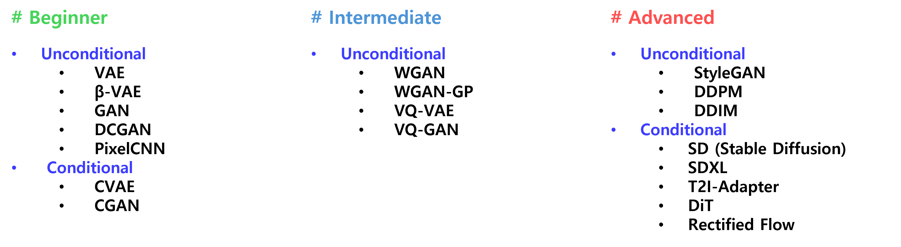

# generative_pytorch
### 선문대 AIIP Lab의 교육자료입니다
## Introduction
**The educational materials are organized so that they can be acquired in the order of Beginner, Intermediate, and Advanced levels.**

## Summary

## Method
- Each generative model is provided in the form of a **python script(.py)** or **notebook(.ipynb)**.
- Each model folder has a Markdown with a description.
- Markdown provides **brief theoretical explanation of the model and Colab Notebook**.
## Lecture Video (KR)
- [VAE](https://www.youtube.com/watch?v=aWrm_CUBPLk)
- [GAN](https://www.youtube.com/watch?v=vZdEGcLU_8U)
- [Diffusion](https://www.youtube.com/watch?v=jaPPALsUZo8&t=697s)
## Author
Gyuseok Lee(https://github.com/gyuseok0917)
